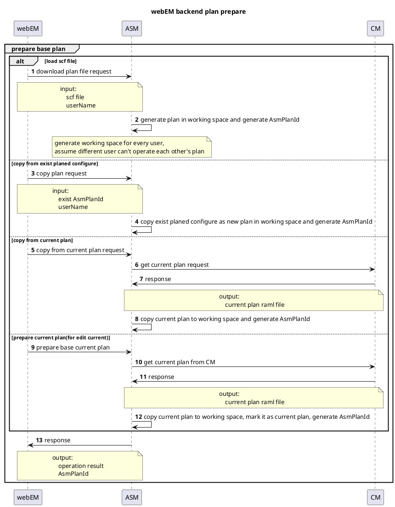
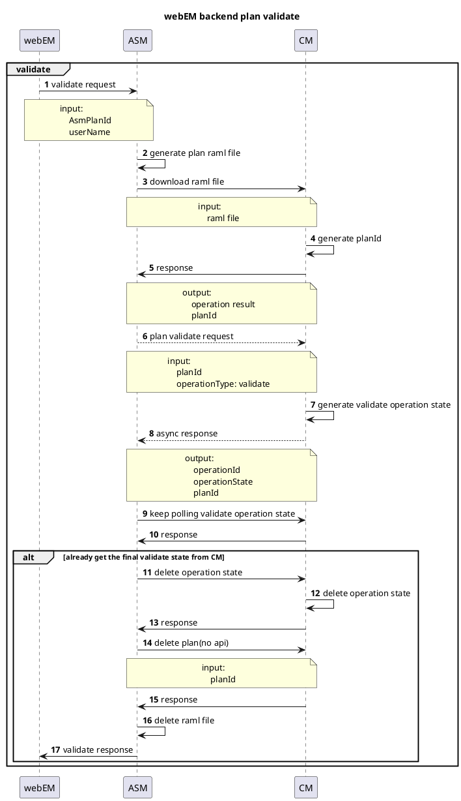
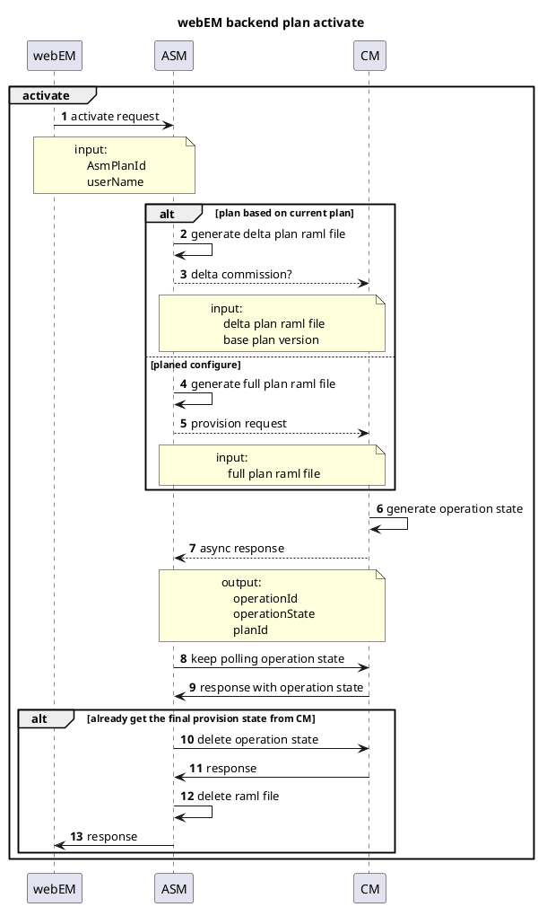
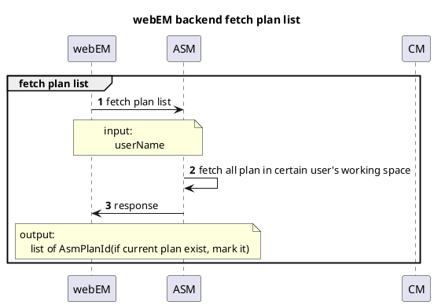
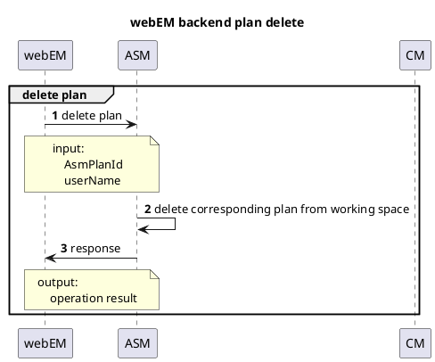
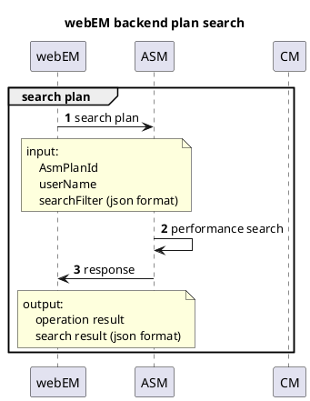
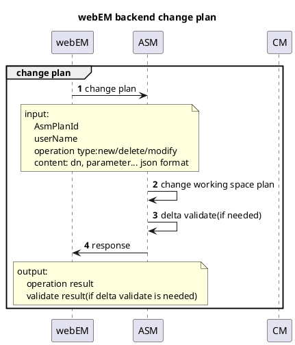
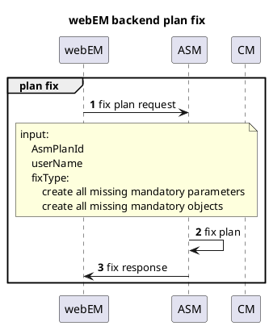
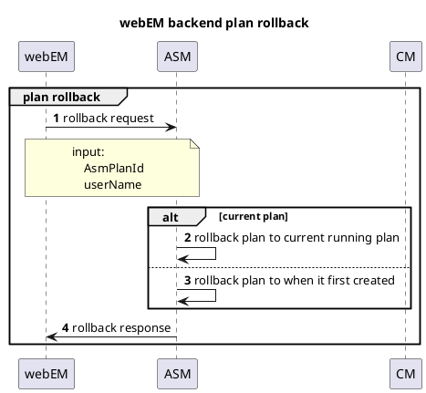

# 5GC000235 webEM backend side UCs

## prepare plan

* what is different between "copy from current plan" and "prepare base current plan".  "copy from current plan" it means operator want generate an new planned configuration which based on current plan. eventually, this new plan will commission as a full plan. but "prepare current plan" is that operator want edit current running plan, and eventually, this this plan will commission as a delta plan.

## validate plan

* currently CM only support validate as 3 steps  1. download plan file, 2.perform validate, 3. delete plan file from CM. wish it could provide an all in one operation such as provision.

* will CM support delta validate?

* it is better if ASM could perform validate by it self

## activate plan

## fetch plan list

* its for webEM could get all plan list incase webEM restart

## delete plan

* ASM side didn't delete any plan, unless webEM ask for it.

## search plan

## change plan

* not sure if ASM side could perform validate by it self

* not sure delta validate is ready or not

* since validation need take time, better not commit change parameter level 

## fix plan

## rollback plan

* for current plan, rollback is to current running plan
